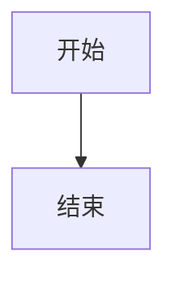
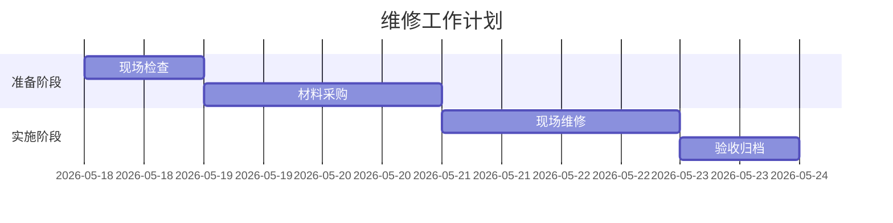
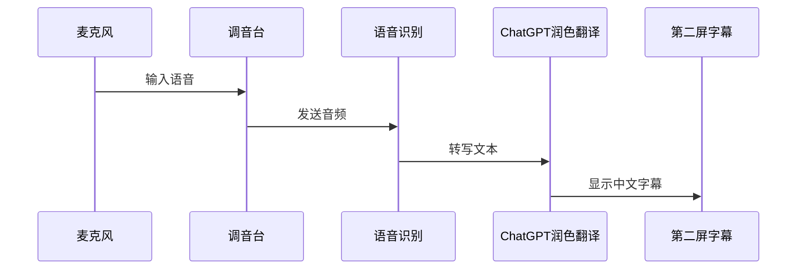

[TOC]
**你好**
> Guten Tag

``大`家`好``

<ins>will be underlined</ins>
<u>will be underlined</u>
# 标题一

### 标题二

$1+1=2$

区块链
: block Chain
#  标题一
> ## ✈️ Flight to your heart!

| abc | abc |
| --- | --- |
| abc | abc |

abc | abc
--- | ---
abc | abc

abc | abc
--- | ---
abc | abc

[pohnpei](https://static.scientificamerican.com/sciam/cache/file/7A715AD8-449D-4B5A-ABA2C5D92D9B5A21_source.png?w=1350)

> [!IMPORTANT]
> zhege henzhongyao 

> >[!TIP]
> 
###### 标题三

> [!CAUTION]
> 
love **is** bold
bold **is** bold

a**pp**le
a__pp__le

&nbsp;&nbsp;&nbsp;&nbsp;This is the first sentence of my indented paragraph.
&nbsp;&nbsp;&nbsp;&nbsp;&nbsp;&nbsp;&nbsp;&nbsp;This is the first sentence of my indented paragraph.
a_pp_le 
a*pp*le 
a___pp___le 
a***pp***le 

<em>abc</em>
阿斯顿发
> this is a blockquote
> isn't it interestinig?  
> 
>> Yes, it is indeed very funny.
>
>OK, good 
==阿斯顿发==
阿斯顿发
阿斯顿发
阿斯顿发

<https://www.youtube.com/watch?v=UVlNm1uS78c>

[](https://www.youtube.com/watch?v=ECXkNmRMGHY)

<a href="https://www.google.com" target="_blank">谷歌网站</a>

!!! note
    这是一个 note 提示块。

| Syntax      | Description |
| ----------- | ----------- |
| Header      | Title |
| Paragraph   | First paragraph. <br> Second paragraph. |


1983/. good

- 2006. hello
- 1968. 
- 25.

 &copy;

1.  sdf 

- this is  the first item
- this is the second item

third
hello

- forth
- 2012/. asdfsfdf 

1. abc
2. 234
3. abc
4. abc
1. abc
1. abc

abc

4. abc
3. asdf 
4. asdf
   1. sdf
5.   234
6.   sdf 
7.   asdf
8.   sdf
9.   sdf
10.  
sdf 
111. sdf 
112. asdf 
113. 


``Use `code` in your Markdown file.``

    你好


```python
你好
baise
```

这是段内换行  
看看这是什么效果

&nbsp;
&nbsp;
&nbsp;
&nbsp;
&nbsp;


{width="60%"}


哈哈  
哈哈哈

> [!DANGER] 这是一段警告
> 内容是关于什么的

离开家阿&nbsp;&nbsp;&nbsp;&nbsp;&nbsp;&nbsp;&nbsp;&nbsp;&nbsp;&nbsp;&nbsp;斯顿发离开家


1. abcdefg  
2. asdf<br>
3. asdfasdf
4. asdfasdfasdfasdf

- [x] asdfasdf


阿斯顿发水电费  阿斯顿发       阿斯顿发水电费     阿斯顿发水电费、阿斯顿发、阿斯顿发水电费、阿斯顿发
阿斯顿发水电费阿斯顿发阿斯顿发
阿斯顿发发生大幅度说阿斯顿发水电费阿斯顿发阿斯顿发阿斯顿阿斯顿发阿斯顿发自行车v去玩儿阿斯顿发阿斯顿发阿斯顿发阿斯顿发阿斯顿发阿斯顿发阿斯顿发阿斯顿发阿斯顿发阿斯顿发阿斯顿发

阿斯顿发

这是正常切换段落<br>
哈哈哈哈
这不是一样的吗？

阿斯顿发  阿斯顿发  阿斯顿撒发的  
阿斯顿发阿斯顿发阿斯顿发阿斯顿发阿斯顿发阿斯顿发


| abc  |abc   |abc   |   |   |
|---|---|---|---|---|
|  阿斯顿发 |   |  阿斯顿发 |   | 阿斯顿发  |
|   |   |   |   |   |
|   |   |   |   |   |

## abc

[tutor](./image-4.png)

<a href="./image-4.png">tutor</a>

[clickalbe pseudo]([link label])

[link label]: http://www.google.com  "description"

[可点击的替代性文字][链接标签]

[链接标签]: http://www.youtube.com "鼠标悬停时的说明性文字"


~~你好~~

~~这是一段删除线文字~~

{width="80%"}

<figure style="display: flex; justify-content: flex-start; margin: 1em 0;">
  <div style="width: 30%; display: flex; flex-direction: column-reverse;">
    
    <figcaption style="font-size: 14px; color: gray; margin-top: 6px; margin-bottom: 6px; text-align: right;">iamcaption</figcaption>
  </div>
</figure>

:information_source: 本节说明系统的基本运行逻辑。

:warning: 修改配置文件前，请先备份原始文件。

:white_check_mark: 完成以上步骤后，即可重新启动服务。


> ⚠ 注意：修改 `settings.json` 前，请先复制备份。

> ℹ 说明：本配置仅影响当前 VS Code 用户设置，不会修改系统设置。

> ✓ 完成：保存文件后，重新打开 Markdown 预览窗口。
&#x26A0 

&#x2139; 说明
&#x26A0; 注意
&#x2713; 正确
&#x2717; 错误
&#x2192; 


````md
```dataviewjs
dv.paragraph(`
~~~mermaid
graph TD
    A --> B
~~~
`)
```
````

> abcdefg
>
> abcdefg
> good enough

>>>> hijklmnopq
 
> rstuvwxyz
>>haha

    abcdefg
    hijiklmn
    hahaheihei
abc`abc`abc
`;lkj nihaoya 你好呀`

```python
def pring()
pass
```


```
ℹ 说明
⚠ 注意
✓ 正确 / 完成
✗ 错误
◆ 重点
▸ 步骤
→ 菜单路径 / 流程方向
☑ 已完成
☐ 待完成
```

> ℹ **说明**  
> 这里解释某个功能的基本含义。

> ⚠ **注意**  
> 这里提醒可能出错或需要谨慎操作的地方。

> ✓ **完成条件**  
> 这里说明如何判断操作已经成功。

> ✗ **常见错误**  
> 这里列出错误写法或错误操作。

> 💡 **建议**  
> 这里给出更好的做法或经验。


> ℹ **说明**  
> 这里解释某个功能的基本含义。

> ⚠ **注意**  
> 这里提醒可能出错或需要谨慎操作的地方。

> ✓ **完成条件**  
> 这里说明如何判断操作已经成功。

> ✗ **常见错误**  
> 这里列出错误写法或错误操作。

> 💡 **建议**  
> 这里给出更好的做法或经验。


✅
> ℹ **说明**  丆∅
> 这里解释某个功能的基本含义。

> ⚠ **注意**  
> 这里提醒可能出错或需要谨慎操作的地方。

> ✓ **完成条件**  
> 这里说明如何判断操作已经成功。

> ✗ **常见错误**  
> 这里列出错误写法或错误操作。

> 💡 **建议**  
> 这里给出更好的做法或经验。


**大家好**

- niao
- wohao
- dajiahao

- niao
- wohao
- dajiahao

- niao
  - niao
    - niao

```python {.line-numbers highlight=2}
def test_print():
  pass
  ```

⚠️ 注意事项

这是 {--需要删除的内容--}。

:fa-hand-o-up

:bell:
:smile:
:fa-weixin:


Column A | Column B | Column C
---------|----------|---------
 3 | haha | C1
 A2 | 23 | C2
  | 423 | C3

1. second
2. third

:fa-thumbs-down


<i class="fa fa-info-circle"></i> 说明
<i class="fa fa-exclamation-triangle"></i> 注意事项
<i class="fa fa-check-circle"></i> 完成情况
本项目已 {~~基本完成~>顺利完成~~} 相关维修工作。

    你好呀
    嘿嘿


阿斯顿发发生大幅度说

    哈哈哈哈

哈哈

这是 {++新增的内容++}。
1. niao

_dazi_
_dazi_
>niao
jushuo suoyi doushi zhende

hahaha nini

```python
def test_codeblock()
def test_codeblock():
  pass
```

- 你好
- 你好
- 你好
- 你好
-

> ℹ **说明**  
> 这里解释某个功能的基本含义。

> ⚠ **注意**  
> 这里提醒可能出错或需要谨慎操作的地方。

> ✓ **完成条件**  
> 这里说明如何判断操作已经成功。

> ✗ **常见错误**  
> 这里列出错误写法或错误操作。

> 💡 **建议**  
> 这里给出更好的做法或经验。

你好  你好 <br>
**你好**

| abc | abc | abc | abc |
| :-- | --- | --- | --- |
| 123 | 123 | 123 | 123 |
| 234 | 234 | 234 | 234 |

~~delete~~

:smile:
: smile :
你好
哈哈哈哈
2. 标题一
===
the bananas is tasty


:smi_

## 标题一

# 你好呀

# hello world

# 加粗内容**

**加粗内容**
6. niao
===

    * niaoya
* niaoya
* niaoya
* niaoya
* niaoya

_**你好**_
你好

_**你好**_

# 粗体字

你好

1. 你好
1. 你好
2. 你好
3. 你好
4. 你好
5. 你好
6. 我们都是谁
   1. 你们都是谁？
      1. 大家后  
         1. 你们好 1SDFSDFSDF

***

___


8. 你好
=
hallo
**abc**
_abc_

abcdeffjisdf  
阿斯顿发发生大幅度说

阿斯顿发水电费
阿斯顿发撒地方
阿斯顿发水电费

引用变量：[abc]

[abc]:www.google.com

- abc
- - abc
- - abc
- abc

- abc

- abc

- abc

---
___
women de mubiaoshi [abc]
[abc]: <https://google.com>

<http://www.google.com>
<www.google.com>

```python
def print_name():
print("markdown")
```

'abc'

    def test_print()
  
  def test_print()

  sdf
    sdf
`niao`
"niao"

  '''python
  def print_name():
  print("markdown")
'''

```python
def test_codeblock()
pass
```

    pipenv shell
pipenv install --skip-lock

    def test_print():
>pass
>_niaosdf_
abc
abc
heiheihei
>>
>**嘿嘿嘿嘿**
> haha

**haha**
abc

> niao
> niao
>abc

**_~~niao~~_**

\\
\*
\!
~~abc~~
~~哈哈哈哈~~
☺️❤️‍🔥Z∅ℇ∞
niabcaoabc
:shit:
:abc
:infinity:
abc
:cn:


<figure style="text-align: center; margin: 0;">
  " alt="" width="40%" style="display: block; margin: 0 auto;">
  <figcaption style="font-size: 20px; color: #f31717; margin-top: 0px;">Pohnpei State Government Building</figcaption>
</figure>

<figure style="text-align: center;">
  " alt="" width="80%">
  <figcaption style="font-size: 14px; color: #888; margin-top: 0px;">波纳佩州政府办公楼电脑效果图</figcaption>
</figure>

| abc | abc | abc | abc |
| --- | --- | --- | --- |
| abc | abc |     |     |

| abc  | abc  | abc    | abc  |
| ---- | ---- | ------ | ---- |
| 你好 | 我好 | 大家好 | 哈哈 |

| abc | abc | abc |
| --- | --- | --- |
hello hello   hello

xingming lianling  gongzuoshijian  beizhu
123 789 9 987
asdf  asdf  sdf  sdf
zcxv xcv zxcv asdf

| xingming | lianling | gongzuoshijian | beizhu |
| :------: | -------: | -------------- | ------ |
|   123    |      789 | 9              | 987    |
|   asdf   |     asdf | sdf            | sdf    |
|   zcxv   |      xcv | zxcv           | asdf   |

| abc  | abc  |
| ---- | ---- |
| 哈哈 | 哈哈 |
| 哈哈 | 哈哈 |

| 大家好     | 你好呀 |
| ---------- | ------ |
| 鞋子的速度 | 非常快 |
|            |
Column A | Column B | Column C
---------|----------|---------
 A1 | B1 | C1
 A2 | B2 | C2
 A3 | B3 | C3     |
| 鞋子       | 衣服   |
| 鞋子       | 裤子   |
|            |        |

Column A | Column B | Column C
---------|----------|---------
 打字 | B1 | C1
 A2 | B2 | C2
 A3 | B3 | C3  ｜
| 水电费 | 水电费 | 阿斯顿发

|   |   |
|---|---|
|   |   |

table

table

| a | b |

- [ ] abc
- [x] abc
- [x] haha

| abc     | abc    | abc   |
| ------- | ------ | ----- |
| xianzai | kaishi | shuru |
| bucuo   | jiushi | bucuo |
| haha    | heihei | nini  |
|

~~~Python
def print()
pass
~~~

  ```python
  def print_name():
  print("markdown")
```

| abc | abc |
| --- | --- |
| abc | &#124; |
| abc | abc |
| abc | abc |
| abc | abc |

| abc | abc |
| --- | --- |
| xyz | xyz |
|     |     |

H~2~O
H^2^O

    nihao
    dazi de neirong 
    chengixanchulai 

```
hahahah 
```

    def print()
    pass

> python print
>

~~~python
def print()
~~~

阿斯顿发

---


<div style="display:flex; align-items:center; justify-content:center; margin:24px 0;">
  <span style="flex:1; height:1px; background:#ccc;"></span>
  
  <span style="flex:1; height:1px; background:#ccc;"></span>
</div>

> hello 

`hello` 


# 标题一
abc

# 标题一
abc

## 标题二
abc

## 标题二
abc

### 标题三
abc

### 标题三
abc

# 标题一
abc

## 标题二
abc

[heading 1](#标题一-1)
[heading 1](#标题一-2)
[heading 2](#标题二-1)
[heading 2](#标题二-2)
[heading 3](#标题三)
[heading 3](#标题三-1)
[heading 1](#标题一-4)
[heading 2](#标题二-3)

引用脚注
xyz [^1]
asdf
asdf
asdf
asdf
asdf [^1]
asdf
asdf
asdf[^1]
asdf
asdf
asdf[^2]
asdf
asdf
asdf
> [!IMPORTANT]
> niao
> niao


asdf
asdf
asdf
asdf
定义脚注
>[!NOTE]
> abc
> abc


<mark>你是一个大傻逼</mark>，说的就是==你==


今天我们需要去现场检查 <p style="color: #4ed012">波纳佩政府办公楼</p> 的弱电项目。

今天我们需要去现场检查 <mark style="color: #4ed012">波纳佩政府办公楼</mark> 的弱电项目。

<mark style="color: #4ed012">nihaoniu</mark> hahahah


<p style="color: #4ed012">abc</p> abc

<mark style="color: #d01235">abc</mark> abc


<mark style="color: #48d012">abc</mark> abc

<p style="color: #4ed012">abc</p> abc

<p style="background-color: yellow;">abc</p> abc

<mark style="background-color: yellow;">abc</mark> abc

<p style="color: #4ed012">abc</p> abc

/* 定义一个标准的警告提示框 */
.note-warning {
    background-color: #f8d7da;
    border-left: 5px solid #dc3545;
    padding: 12px;
    border-radius: 4px;
}

<div class="note-warning">
    **注意：** 现场设备调试前，务必确认地线已正确连接！
</div>

上标：<sup>abc</sup>

下标：<sub>abc</sub>

<u>abc</u>

<p style="font-family:helvetica">abc</p>
<p style="font-size:20px">abcdd</p>

<p style="font-family: 'Helvetica';">abc</p>

<p style="font-family:仿宋">你好</p>


<p style="font-size:40px">大家好</p>


 


{width="90%"}
{width="60%"}

{width="600px"}


 

figimg

<figure style="text-align: leftP; margin: 1em 0;">
  
  <figcaption style="font-size: 14px; color: red; margin-top: 6px;">ROG NUC 2026</figcaption>
</figure>

<figure style="display: flex; flex-direction: column; align-items: flex-end; margin: 1em 0;">
  
  <figcaption style="width: 100%; font-size: 18px; color: red; margin-top: 6px; margin-bottom: 6px; text-align: right;">Image caption</figcaption>
</figure>

<figure style="display: flex; justify-content: flex-start; margin: 1em 0;">
  <div style="width: 90%; display: flex; flex-direction: column;">
    
    <figcaption style="font-size: 24px; color: gray; margin-top: 6px; margin-bottom: 6px; text-align: center;">Alles Gute</figcaption>
  </div>
</figure>     

<figure style="display: flex; justify-content: flex-start; margin: 1em 0;">
  <div style="width: 60%; display: flex; flex-direction: column-reverse;">
    
    <figcaption style="font-size: 14px; color: dark
  Salmon; margin-top: 6px; margin-bottom: 6px; text-align: right;">GREAT!</figcaption>
  </div>
</figure> 

<div style="display:none">abc</div>

<!-- abc -->

[#] this is my notes

[this is my notes]：#

<details><summary><strong>this is a big title</strong></summary>
<p>

***here are the detais of different contents***
# Title 1
## Title 2
<strong>good</strong>
```python
def print_hello():
    print("hello")
```
> Alles Gute
</p>
</details>

如果想要知道更多项目信息请查阅：[公司网站]

[公司网站]: http://www.cjic.cn (全球资源整合专家)

感兴趣的话可以联系[#]

[#]: (这里是一段注释，由于没有被引用，它不会显示出来)

<details>
<summary>可折叠的标题</summary>

**被隐藏、被折叠的内容**

<strong>BOLD</strong>

## Heading 2

```python
def print()
print(hello world)
```

- items 1
- items 2
- items 3
</details>

# heading 1

> 天气如何

## heading 2

> 心情如何

### heading 3

今天有新的收获吗？
<details><summary>待办事项</summary>

- [x] nihaoniu
- [ ] abc
- [x] haha 
- [x] heihei
- [x] niubi
</details>

imgur


556


